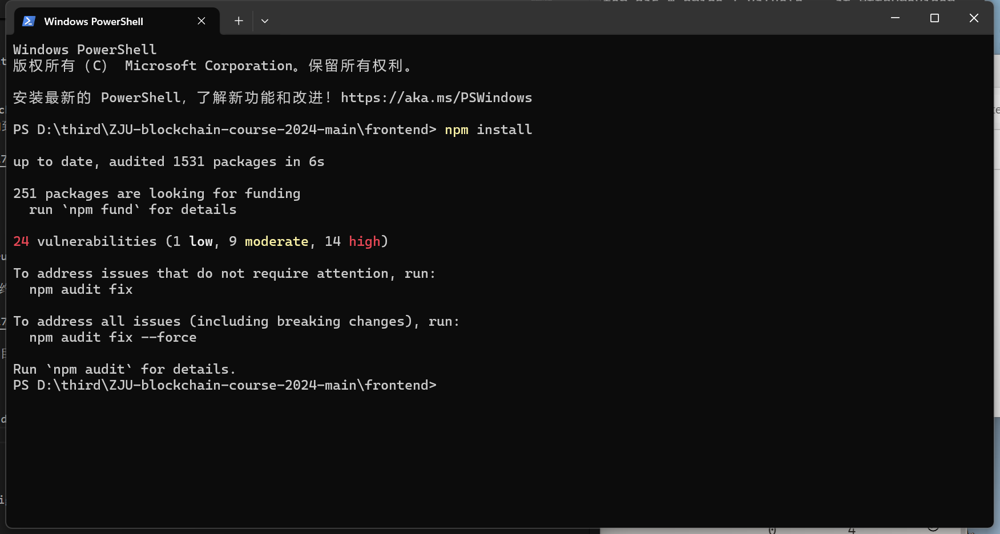

# ZJU-blockchain-course-2024

## 项目介绍

本项目是一个去中心化的房屋购买系统，基于以太坊智能合约和 NFT 技术实现。用户可以：

    领取房屋 NFT：每个用户可以免费领取一栋房屋，代表为一个 NFT。
    挂单出售房屋：用户可以将自己的房屋挂单出售，设置出售价格。
    查看正在出售的房屋：用户可以浏览所有正在出售的房屋列表。
    购买房屋：使用以太币（ETH）购买他人挂单的房屋。
    手续费机制：在交易过程中，系统根据挂单时长和固定比例收取手续费。

该项目主要由智能合约和前端应用组成：

    智能合约：使用 Solidity 编写，部署在本地的 Ganache 区块链上，管理房屋的创建、挂单、交易等逻辑。
    前端应用：使用 React 和 ethers.js，实现与智能合约的交互，提供用户界面。

## 如何运行

按照以下步骤，用户可以在本地运行并体验该项目：
1. 启动 Ganache

    下载并安装 Ganache（https://trufflesuite.com/ganache/），这是一个用于本地以太坊开发的区块链模拟器。
    启动 Ganache，选择 “Quickstart” 模式，Ganache 会自动创建一个本地区块链网络，并提供 10 个预置账户，每个账户有 100 ETH 的余额。
    
    

2. 在 ./contracts 目录安装依赖

    bash

    cd contracts
    npm install

    

3. 编译智能合约

    bash

    npx hardhat compile

    

4. 配置网络连接

    修改 hardhat.config.ts：

    在 contracts/hardhat.config.ts 中，添加 Ganache 网络配置：

    typescript

    import { HardhatUserConfig } from "hardhat/config";
    import "@nomicfoundation/hardhat-toolbox";

    const config: HardhatUserConfig = {
      solidity: "0.8.20",
      networks: {
        ganache: {
          url: "http://127.0.0.1:7545", // Ganache 默认 RPC 地址
          chainId: 1337, // Ganache 默认 Chain ID
          accounts: [
            // 从 Ganache 中复制私钥，添加到这里
            // 示例：
            // "0xaaaaaaaaaaaaaaaaaaaaaaaaaaaaaaaaaaaaaaaaaaaaaaaaaaaaaaaaaaaaaaaa",
            // "0xbbbbbbbbbbbbbbbbbbbbbbbbbbbbbbbbbbbbbbbbbbbbbbbbbbbbbbbbbbbbbbbb",
          ],
        },
      },
    };

    export default config;

    添加账户私钥：
        打开 Ganache，点击账户右侧的 钥匙图标，复制私钥。
        将私钥添加到 accounts 数组中，确保包含至少一个账户的私钥。

    

5. 部署智能合约

    bash

    npx hardhat run scripts/deploy.ts --network ganache

    记录部署后的合约地址，将在后续步骤中使用。

    

6. 在 ./frontend 目录安装依赖

    bash

    cd ../frontend
    npm install

    

7. 配置前端应用

    修改 src/config.js：

    javascript

    export const BUY_MY_ROOM_ADDRESS = '0x您的BuyMyRoom合约地址'; // 替换为部署合约时记录的地址

    

8. 更新 ABI 文件：

    将编译后的合约 ABI 文件复制到前端项目中：

    bash

    cp ../contracts/artifacts/contracts/BuyMyRoom.sol/BuyMyRoom.json src/contracts/

    

9. 配置 MetaMask 钱包

    安装 MetaMask 插件（如果尚未安装）。

    添加本地网络：

        打开 MetaMask，点击网络选择器，选择 “添加网络”。

        输入以下信息：
            网络名称：Ganache
            新 RPC URL：http://127.0.0.1:7545
            链 ID：1337
            货币符号：ETH

        保存网络。
    
    

    导入账户：
        在 Ganache 中，复制MNEMONIC。
        在 MetaMask 中，选择恢复账号。
        粘贴从 Ganache 复制的账户私钥助记词，点击 “确认”。
    
    

10. 启动前端应用

    bash

    npm run start

    前端应用将自动在浏览器中打开（默认地址为 http://localhost:3000）。

    

11. 体验应用功能

    连接钱包：
        在前端页面上，点击 “连接钱包” 按钮。
        在 MetaMask 中授权连接。

    

    领取房屋 NFT：
        点击 “领取房屋 NFT” 按钮。
        在 MetaMask 中确认交易。
        等待交易完成，页面会更新您该账户的房屋列表。

    

    挂单出售房屋：
        在 “我的房屋列表” 中，点击 “挂单出售” 按钮。
        输入出售价格（以太币）。
        在 MetaMask 中确认交易。
        房屋将出现在 “正在出售的房屋列表” 中。

    

    购买房屋：
        切换到另一个账户（参考下面的步骤）。
        在 “正在出售的房屋列表” 中，找到要购买的房屋，点击 “购买” 按钮。
        确认购买信息，在 MetaMask 中确认交易。
        交易完成后，房屋将转移到当前账户，而手续费将会转移到合约拥有者账户。(注意手续费是从卖家方扣除，不直接需要买家额外支付)

    

12. 切换账户（模拟不同用户）

    克隆标签页，在 MetaMask 中点击上方的选择账户，更改账户，选择连接到localhost。

## 功能实现分析

本项目完成了以下功能：

    领取房屋 NFT：
        实现：智能合约中的 claimHouse 函数允许用户领取一栋房屋，生成一个唯一的 NFT，并记录房屋信息。
        过程：用户在前端点击 “领取房屋 NFT”，调用合约的 claimHouse 函数，交易成功后，房屋 NFT 归属用户。

    挂单出售房屋：
        实现：智能合约的 listHouse 函数允许房屋持有者设置出售价格，将房屋挂单。
        过程：用户在前端选择自己的房屋，输入出售价格，调用 listHouse 函数，房屋状态更新为在售。

    查看正在出售的房屋：
        实现：智能合约提供 getAllListedHouses 函数，返回所有挂单房屋的列表。
        过程：前端定期调用该函数，获取最新的在售房屋信息，展示在 “正在出售的房屋列表” 中。

    购买房屋：
        实现：智能合约的 buyHouse 函数允许用户使用以太币购买在售的房屋，完成交易并转移所有权。
        过程：用户在前端选择要购买的房屋，确认购买，调用 buyHouse 函数，支付相应的以太币，交易成功后房屋归属用户。

    手续费机制：

        实现：在 buyHouse 函数中，根据挂单时长和固定费率计算手续费，交易时扣除并转入合约拥有者账户。

        过程：手续费计算公式为：

        手续费 = 挂单时长（秒） × 固定费率 × 房屋价格 / 10000

    前端交互界面：
        实现：使用 React 和 ethers.js，构建用户界面，实现与智能合约的交互。
        过程：前端提供连接钱包、领取房屋、挂单出售、查看列表、购买房屋等按钮和界面，用户操作直观便捷。

## 总结

该项目通过智能合约和前端应用的结合，实现了一个完整的去中心化房屋交易系统，用户可以体验到 NFT 的发行、交易以及区块链上的资产转移流程。整个系统基于以太坊的智能合约，使用以太币进行交易，体现了区块链技术在数字资产交易中的应用。

## 参考内容

- 课程的参考Demo见：[DEMOs](https://github.com/LBruyne/blockchain-course-demos)。

- 快速实现 ERC721 和 ERC20：[模版](https://wizard.openzeppelin.com/#erc20)。记得安装相关依赖 ``"@openzeppelin/contracts": "^5.0.0"``。

- 如何实现ETH和ERC20的兑换？ [参考讲解](https://www.wtf.academy/en/docs/solidity-103/DEX/)

